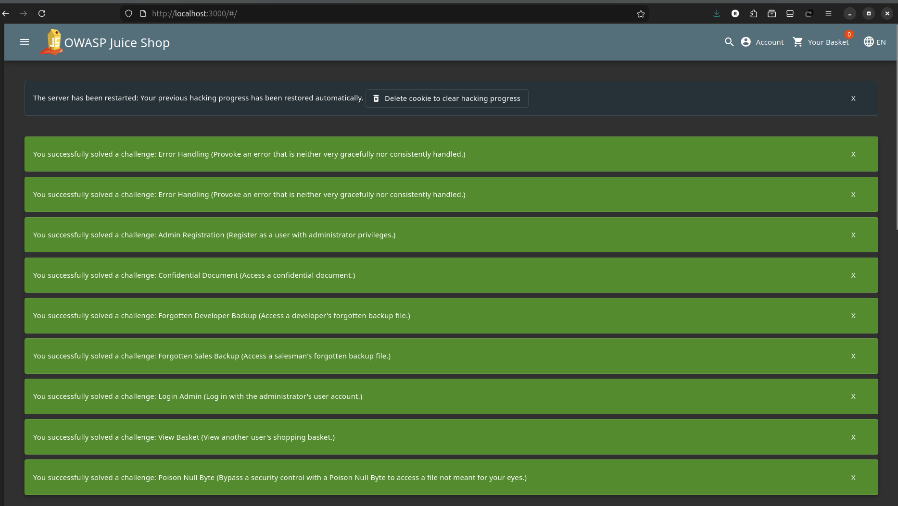
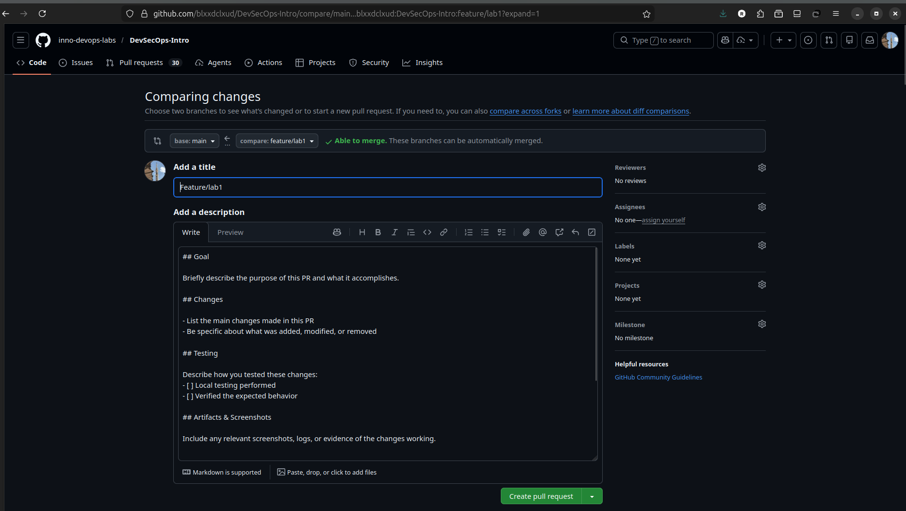

# Triage Report — OWASP Juice Shop

## Scope & Asset
- Asset: OWASP Juice Shop (local lab instance)
- Image: bkimminich/juice-shop:v19.0.0
- Release link/date: https://github.com/juice-shop/juice-shop/releases/tag/v19.0.0 — September 2025
- Image digest: sha256:2765a26de7647609099a338d5b7f61085d95903c8703bb70f03fcc4b12f0818d

## Environment
- Host OS: Ubuntu 24.04.3 LTS (Noble Numbat)
- Docker: 28.4.0

## Deployment Details
- Run command used: `docker run -d --name juice-shop -p 127.0.0.1:3000:3000 bkimminich/juice-shop:v19.0.0`
- Access URL: http://127.0.0.1:3000
- Network exposure: 127.0.0.1 only [x] Yes  [ ] No


## Health Check

### Page load
The Juice Shop homepage loads successfully at http://127.0.0.1:3000. The page shows the storefront with products like Apple Juice, Banana Juice, and various merchandise.

### API check
First 10 lines from `curl -s http://127.0.0.1:3000/api/Products | head`:

```json
{"status":"success","data":[{"id":1,"name":"Apple Juice (1000ml)","description":"The all-time classic.","price":1.99,"deluxePrice":0.99,"image":"apple_juice.jpg"},{"id":2,"name":"Orange Juice (1000ml)","description":"Made from freshly squeezed oranges.","price":2.99,"deluxePrice":2.49,"image":"orange_juice.jpg"},{"id":3,"name":"Eggfruit Juice (500ml)","description":"Now with even more exotic flavor.","price":8.99,"deluxePrice":8.49,"image":"eggfruit_juice.jpg"}...]}
```

## Surface Snapshot (Triage)
- Login/Registration visible: [x] Yes  [ ] No — notes: Login and "Account" menu visible in top navigation bar
- Product listing/search present: [x] Yes  [ ] No — notes: Search bar present, products displayed on main page
- Admin or account area discoverable: [x] Yes  [ ] No — notes: Account menu shows login/register options, admin area at /#/administration
- Client-side errors in console: [ ] Yes  [x] No — notes: No critical errors observed
- Security headers (quick look): `curl -I http://127.0.0.1:3000` shows:
  - X-Content-Type-Options: nosniff
  - X-Frame-Options: SAMEORIGIN
  - Feature-Policy: payment 'self'
  - No CSP header present
  - No HSTS header (expected for localhost)

## Risks Observed (Top 3)

1) **Missing Content Security Policy (CSP)**: The application does not send a CSP header, which makes it vulnerable to XSS attacks. An attacker could inject malicious scripts.

2) **Visible Error Messages**: The application returns detailed error messages (like "Unexpected path") which could help attackers understand the internal structure and find vulnerabilities.

3) **Client-side routing exposed**: The Angular-based SPA exposes routes like `/#/administration` which could be discovered by attackers and lead to privilege escalation attempts.

---

# Task 2 — PR Template Setup

## PR Template Creation

I created the file `.github/pull_request_template.md` with the following sections:
- **Goal** — to describe the purpose of the PR
- **Changes** — list of what was changed
- **Testing** — how the changes were tested
- **Artifacts & Screenshots** — evidence of working changes

The checklist includes 3 items:
1. PR has a clear, descriptive title
2. Documentation updated if needed
3. No secrets or large temp files included

## Verification

After pushing the template to the main branch, when I create a new PR, GitHub automatically fills the PR description with our template. This saves time and makes sure everyone includes the same information.



## How Templates Improve Workflow

PR templates help the team because:
- Everyone uses the same format, so it's easier to review
- New team members know exactly what information to include
- Important things like testing and security checks are not forgotten
- Reviews go faster because all needed information is already there

---

# GitHub Community

## Why Stars Matter

Starring repositories helps in several ways:

- Bookmarking: Stars let you save projects for future reference
- Recognition: High star counts show community trust and project quality
- Visibility: Stars help projects appear in GitHub recommendations and searches
- Encouragement: Stars motivate maintainers to continue development

## Why Following Matters

Following developers is important for:

- Learning: See what experienced developers work on and how they solve problems
- Networking: Build professional connections for future collaboration
- Discovery: Find new projects through your network's activity
- Career Growth: Stay updated on industry trends and tools

I have starred the course repository and simple-container-com/api, followed the professor and TAs, and followed classmates on GitHub.
